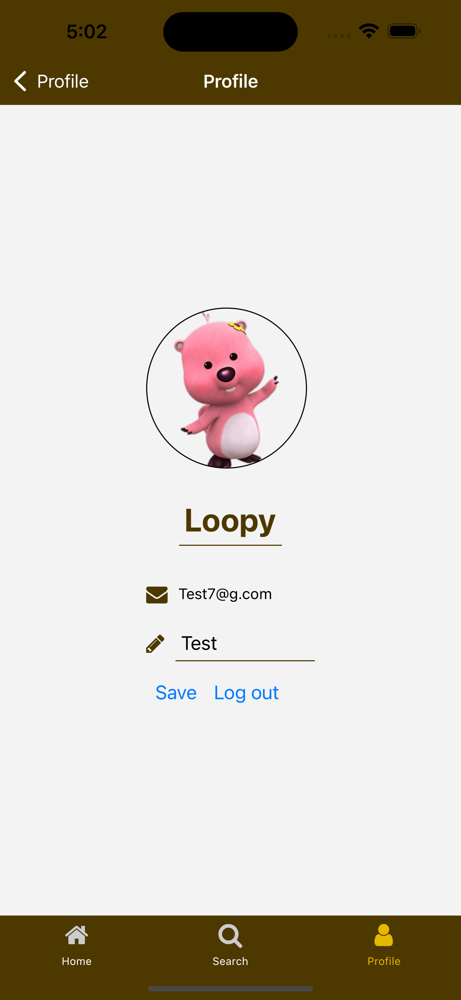

# Trail-finder-project
## Team Members and contributions
### （Mia）Jiaxin Yan
#### Laid the foundation by providing the framework and building stack navigation for the app.
#### Made the components for user to log in, sign out, and editing profile, and contributed to CRU operations of user collection.
#### Built the HomeScreen from functionality of generating top 5 trails to UI.
#### Built the SearchScreen from functionality of different search filter buttons to UI.
#### Improved the style design of the entire system (background pictures, fonts and colors, etc.).

### （Grace）Ya Xiao
#### Integrated the Bing Image Search API for fetching trail image data.
#### Incorporated the functionality of multiple-querying of trail data based on search inputs.
#### Built the ResultScreen from functionality to UI.
#### Implemented the like button functionality and contributed to the CD operations of wishlist collection.

## Features and Progess (screenshots)
* Homepage Screen
#### Display of top 5 trails in Greater Vancouver Area and the tailor trail component.
#### Detailed view: Users can click on any trail image to dive deeper into its details.

* ProfileSection
#### Display the login page for user to login. If they are first-time users, they will be directing to the signup page to register an account.
#### Profile page: after successfully logging in, the user will see the profile page, and can upload an avatar image or edit the description and username.

* SearchScreen
#### Display the search page for user to select the trail features they want to have. When the user hit the search button, a result screen will be navigated to.
#### Detailed view: Users can click on any trails in the result screen(if there's any trail found) to dive deeper into its details.
#### Like it or not. When being directed to the detail page, user can choose to hit the like button or not. If they hit it, the button will be toggled to solid heart.

## Data Model
### The data model of TrailFinder app includes the following three collections:

## 1. traillist
### Description:
### the trails in Greater Vancouver Area

### Attributes:
#### id: unique identifier of the trail

#### trailTitle: the name of the trail

#### camping: the boolean value indicating whether camping is allowed within the trail area

#### difficulty: the difficulty level of the trail

#### dogFriendly: the boolean value indicating whether the trail is dog-friendly

#### publicTransit: the boolean value indicating whether public transit is accessible

#### rating: the rating of the trail

#### imageUri: the uri of the trail image

## 2. users
### Description:
### the app users which are hiking-lovers. This collection stores users' personal information, such as username, avatar, signature(description), wishlist and recommendation.

### Attributes:
#### uid: unique identifier of the user

#### username: name of the user

#### email: the login email of the user

#### description: the self-description of the user

#### avatarUri: the uri of the user

#### wishlist: the liked trails of the user

#### recommendation: the list of recommended trails generated by the app for the user with a descending order of ratings

## 3. wishlist:
### Description:
### the liked trails of each app user

### Attributes:
#### createdAt: the time of the wishitem created

#### userCid: unique identifier of the user

#### trailTitle: the title of the trail

## 4. recommendations:
### Description:
### the collection of lists of recommended trails generated by the app for the user, based on different preference sets

### Attributes:
#### preferenceSet: the preference set that the recommended list is generated based on. It is derived from the user's wishlist.