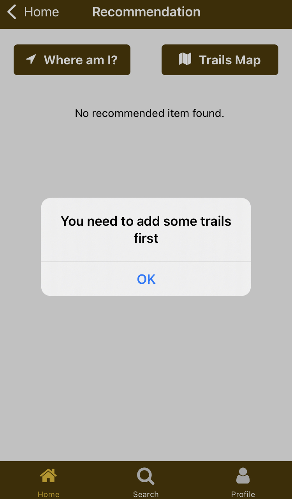
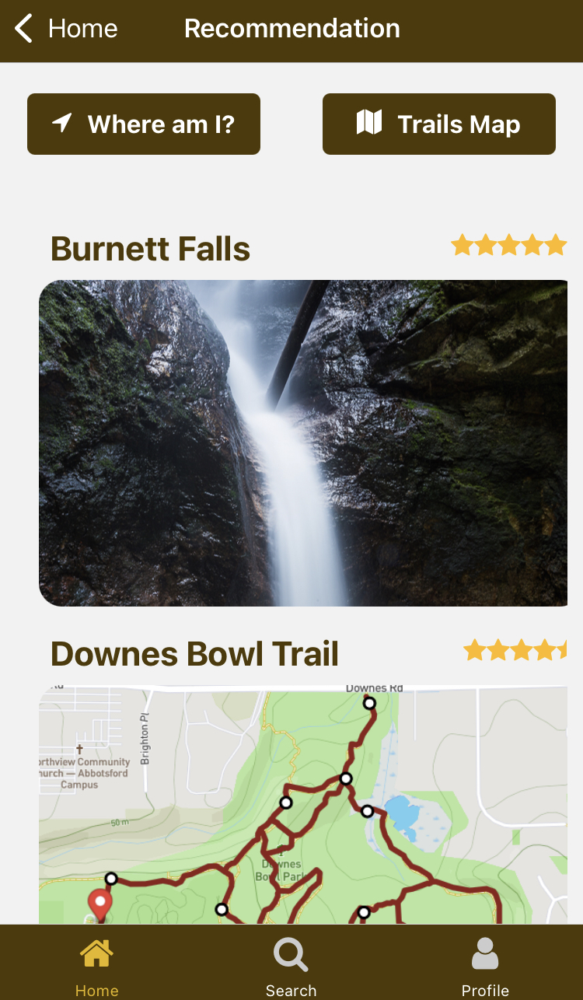
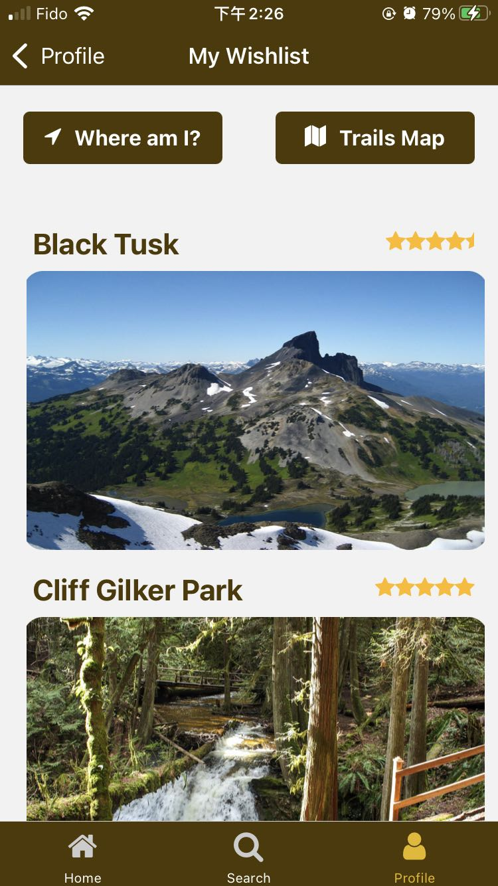
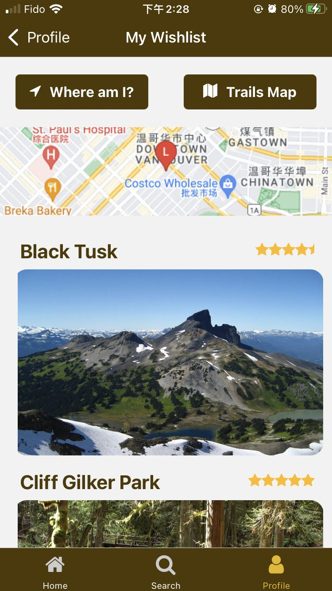
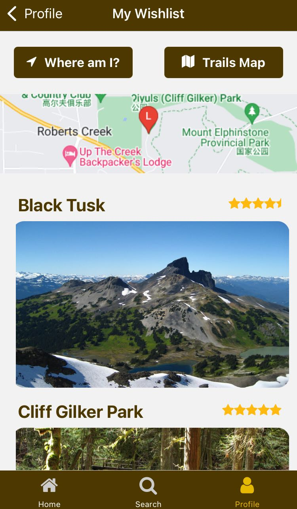
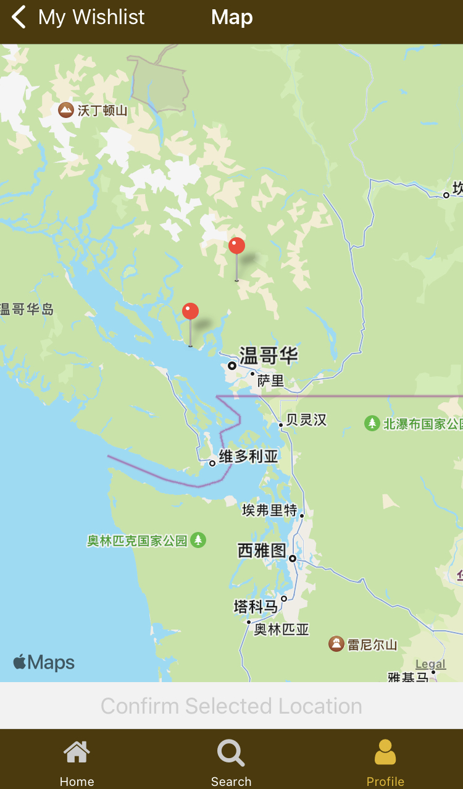
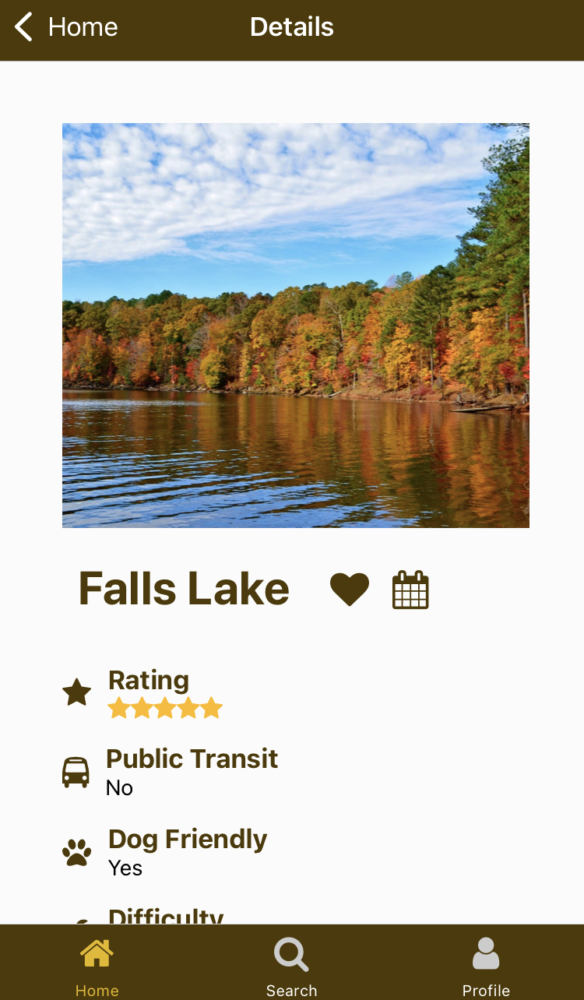
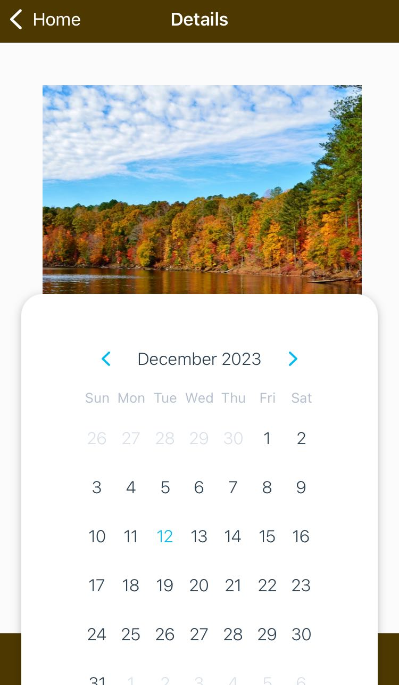

# Trail-finder-project
## Team Members and contributions
### （Mia）Jiaxin Yan
#### Laid the foundation by providing the framework and building stack navigation for the app.
#### Made the components for users to log in, sign out, and edit profiles, and contributed to CRU operations of user collection.
#### Built the HomeScreen from the functionality of generating top 5 trails to UI.
#### Built the SearchScreen from the functionality of different search filter buttons to UI.
#### Improved the style design of the entire system (background pictures, fonts, and colors, etc.).
#### Improved profile screen and used camera to update user avatars.
#### Improved the style design of the search result screen and wishlist screen.

### （Grace）Ya Xiao
#### Built the RecommendationScreen from functionality to UI.
#### Contributed to the recommendation algorithm python script.
#### Implemented the backend in Node.js (api endpoints to fetch data from firebase and to run the python script and get the result).

## How to run the app
#### 1.Modify the urlDomain in @env to your own IPV4 address
#### 2.Install Python 
#### 3.Install Python pandas library by running pip install pandas
#### 4.Install python requests library by running pip install requests
#### 5.run npm install in both client and api folder
#### 6.run npx nodemon index.js to start the server
#### 7.run npx expo start to start the frontend

## Features and Progress (screenshots)
* Homepage Screen
#### Display of top 5 trails in the Greater Vancouver Area and the tailor trail component.
#### Detailed view: Users can click on any trail image to dive deeper into its details.
#### Direct user to the recommendation page if the user is logged in and has a non-empty wishlist, otherwise will be redirected to login page or receive an alert showing that the user has no wishitems, therefore the app cannot generate recommendation for the user.
#### The recommendation page displays the result from the recommendation engine Python script.

* ProfileSection
#### Display the login page for user to login. If they are first-time users, they will be directing to the signup page to register an account.
#### Profile page: after successfully logging in, the user will see the profile page, and can upload an avatar image or edit the description and username.
#### Enable to used camera to update user avatars.

* SearchScreen
#### Display the search page for user to select the trail features they want to have. When the user hit the search button, a result screen will be navigated to.
#### Detailed view: Users can click on any trails in the result screen(if there's any trail found) to dive deeper into its details.
#### Like it or not. When being directed to the detail page, user can choose to hit the like button or not. If they hit it, the button will be toggled to solid heart.

* WishlistScreen
#### Display the wishlist for user to see all trails liked. User can also see them in the interactive map, check the current location and display the selected location on the static map.
#### Detailed view: User can click the liked button to unlike the trail. There's a calendar button that can be used to set notifications for visiting the trail on a specific selected date.

## Data Model
### The data model of TrailFinder app includes the following three collections:

## 1. traillist
### Description:
### the trails in Greater Vancouver Area

### Attributes:
#### id: unique identifier of the trail

#### trailTitle: the name of the trail

#### camping: the boolean value indicating whether camping is allowed within the trail area

#### difficulty: the difficulty level of the trail

#### dogFriendly: the boolean value indicating whether the trail is dog-friendly

#### publicTransit: the boolean value indicating whether public transit is accessible

#### rating: the rating of the trail

#### imageUri: the uri of the trail image

## 2. users
### Description:
### the app users which are hiking-lovers. This collection stores users' personal information, such as username, avatar, signature(description), wishlist and recommendation.

### Attributes:
#### uid: unique identifier of the user

#### username: name of the user

#### email: the login email of the user

#### description: the self-description of the user

#### avatarUri: the uri of the user

#### wishitems: the liked trails of the user

#### recommendationitems: the list of recommended trails generated by the app for the user with a descending order of ratings

## 3. wishlist:
### Description:
### the liked trails of each app user

### Attributes:
#### createdAt: the time of the wishitem created

#### userCid: unique identifier of the user

#### trailTitle: the title of the trail

## Iteration 3
### Implemented the backend in Node.js (api endpoints to fetch data from firebase and to run the python script and get the result).
### Built the recommendation engine in Python

